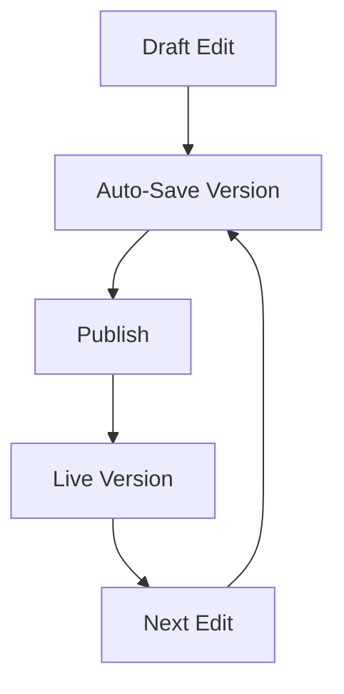

## Overview

Konstantinos K provides powerful tools to organize, collaborate on, and maintain your project documentation. You can structure content hierarchies, share with teams, track changes over time, and search efficiently across all documents. These features help you create a centralized knowledge base that scales with your projects.

<Columns cols={2}>
  <Card title="Flexible Hierarchies" icon="layers" href="/docs/hierarchies">
    Build nested folder structures and pages to match your project's organization.
  </Card>
  <Card title="Team Collaboration" icon="users" href="/docs/collaboration">
    Invite members, assign roles, and work together in real-time.
  </Card>
  <Card title="Version Control" icon="git-branch" href="/docs/versions">
    Track revisions and restore previous versions easily.
  </Card>
  <Card title="Smart Search" icon="search" href="/docs/search">
    Find content instantly with full-text search and filters.
  </Card>
</Columns>

## Structuring Documentation Hierarchies

Create intuitive navigation by organizing your documentation into hierarchies. Start with top-level categories like "Getting Started" and "API Reference", then nest subpages for detailed guides.

<Steps>
  <Step title="Create Folders" icon="folder">
    Use the sidebar to add new folders. Name them descriptively, such as `guides` or `api`.
  </Step>
  <Step title="Add Pages" icon="file-text">
    Inside folders, create MDX pages. Link them using relative paths like `[Installation](./installation.mdx)`.
  </Step>
  <Step title="Reorder Content" icon="move">
    Drag and drop pages and folders to set the order. This updates your navigation automatically.
  </Step>
</Steps>

<Callout kind="tip">
  Limit nesting to three levels deep to keep navigation user-friendly.
</Callout>

## Collaboration and Sharing Options

Invite team members and control access with granular permissions. Share public links for external viewers without accounts.

<Tabs>
  <Tab title="Team Invites" icon="users">
    Send email invites from the workspace settings. Assign roles like Editor or Viewer.
  </Tab>
  <Tab title="Public Sharing" icon="share-2">
    Generate shareable links for specific pages. Set expiration dates for temporary access.
  </Tab>
  <Tab title="Embed Pages" icon="code">
    Copy embed code to include docs in your apps:
    
````html
<iframe src="https://docs.example.com/your-workspace/page" width="100%" height="600"></iframe>
````
    
  </Tab>
</Tabs>

## Version History and Revisions

Every edit creates a new version. You review changes, compare diffs, and revert if needed.



<Expandable title="Compare Versions" default-open="true">
  Select two versions in the history panel to see side-by-side diffs. Restore by clicking "Revert".
</Expandable>

## Advanced Search Functionality

Search across all documents with filters for titles, content, tags, and authors. Use the API for programmatic searches.

<CodeGroup tabs="JavaScript,Python">
  ```javascript
  const response = await fetch('https://api.example.com/v1/search', {
    method: 'POST',
    headers: { 'Authorization': 'Bearer YOUR_TOKEN', 'Content-Type': 'application/json' },
    body: JSON.stringify({
      query: 'authentication',
      filters: { workspace: 'konstantinos-k' }
    })
  });
  const results = await response.json();
  console.log(results.hits);
  ```
  ```python
  import requests
  
  response = requests.post(
      'https://api.example.com/v1/search',
      headers={
          'Authorization': 'Bearer YOUR_TOKEN',
          'Content-Type': 'application/json'
      },
      json={
          'query': 'authentication',
          'filters': {'workspace': 'konstantinos-k'}
      }
  )
  results = response.json()
  print(results['hits'])
  ```
</CodeGroup>

<ParamField path="query" param-type="string" required="true">
  Your search term. Supports full-text matching.
</ParamField>

<ParamField query="workspace" param-type="string" required="false">
  Limit results to a specific workspace ID.
</ParamField>

| Feature | Description | Example Use Case |
|---------|-------------|------------------|
| Full-Text Search | Matches keywords in content | Finding "OAuth setup" guides |
| Tag Filters | Search by custom tags | `api`, `beginner` |
| Date Range | Recent changes only | Last 30 days |

These core features make Konstantinos K your go-to for documentation management. Next, explore [quickstart](/quickstart) for hands-on setup.